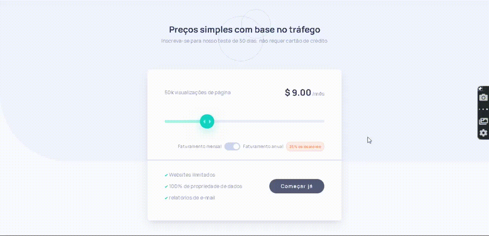
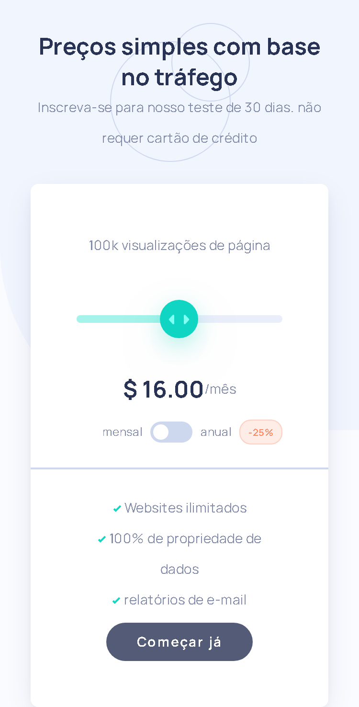
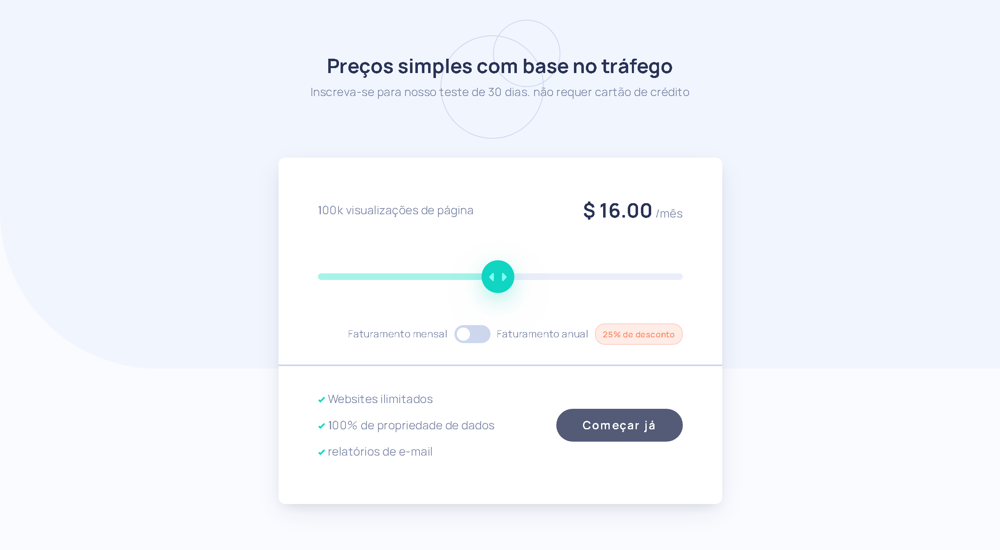

# Projeto interactive pricing

## 🔗<a href="#">Acessar demonstração</a>

---

## 📄 Sobre o projeto

O projeto é uma tela de escolha de preços interativo onde um cliente pode escolher quanto pagar com base no plano de visualizações. Também é possível escolher o plano anual adicionando um desconto de 25%. O projeto é completamente responsivo.

Esse foi um desafio do <a href="https://www.frontendmentor.io/challenges">Front-end Mentor</a>.

## 📚 aprendizado

Nesse projeto eu pude exercitar bastante das minhas habilidades front-end e utilizei Sass como pré-processador CSS. Também exercitei JavaScript ao criar o input type range interativo. 

O input range foi o maior desafio desse projeto, ele tem 5 pontos de escolha, dependendo de onde o cliente soltar o circulo ele vai para o ponto onde está mais proximo. além disso, os valores são modificados em tempo real. Se a escolha de plano do toggle for anual, é acrescentado um desconto de 25% em todos os valores.

## 🚀 Tecnologias utilizadas
As seguintes tecnologias foram utilizadas no desenvolvimento do projeto:

- HTML e CSS
- Sass
- JavaScript

---

### desenvolvido por Carlos Gabriel

---

## 📷 Screenshots

